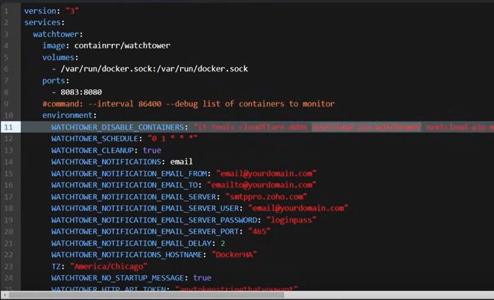

# Part 2 of CICD pipeline: reach the target machines with watchtower

> Note that this is reccomanded only for small applications and home labs. No enterprise uses.

## What is watchtower

[Watchtower](https://github.com/containrrr/watchtower) is an open-source project that automates the task of updating images. 

## first part with Github Actions
GitHub Actions are doing only the "first half" of the deployment pipeline: they are ensuring that every push to GitHub is built to a Docker image which is then pushed to Docker Hub.

## Watchtower as second half pf CICD pipeline
Watchtower will pull the source of the image (in this case Docker Hub) for changes in the containers that are running. The container that is running will be updated and automatically restarted when a new version of the image is pushed to Docker Hub. Watchtower respects tags e.g. q container using ubuntu:24.04 will not be updated unless a new version of ubuntu:24.04 is released.

## Example from docker-compose
Watchtower can be run eg. using the following Docker Compose file:
```yml
services:
  watchtower:
    image: containrrr/watchtower
    environment:
      -  WATCHTOWER_POLL_INTERVAL=60 <em># Poll every 60 seconds</em>
    volumes:
      - /var/run/docker.sock:/var/run/docker.sock
    container_name: watchtower
```

> Be careful, if not settled, watchtower will update all the containers available on the machine!The [documentation](https://containrrr.github.io/watchtower/) describes how this can be prevented.

## Define which container to target for update
### MEthod 1: filtering by enable label
#### From documentation
[...]Filter by enable label
Monitor and update containers that have a ```com.centurylinklabs.watchtower.enable``` label set to true.
```yml
            Argument: --label-enable
Environment Variable: WATCHTOWER_LABEL_ENABLE
                Type: Boolean
             Default: false
```
[...]

If the flag called ```WATCHTOWER_LABEL_ENABLE``` is set to TRUE, it gonna look for that exact label ```com.centurylinklabs.watchtower.enable``` in the containers in your docker distance and gonna monitor them. When a new version/update of the container is available in docker hub, gonna import it in your net.

### Method 2: Filter by disabling specific container names
[...]Filter by disabling specific container names
Monitor and update containers whose names are not in a given set of names.
This can be used to exclude specific containers, when setting labels is not an option. The listed containers will be excluded even if they have the enable filter set to true.
```yml
            Argument: --disable-containers, -x
Environment Variable: WATCHTOWER_DISABLE_CONTAINERS
                Type: Comma- or space-separated string list
             Default: ""
```
[...]

here we use the env variable: WATCHTOWER_DISABLE_CONTAINERS and pass with comma separated or space separated the exact name of containers that you do not want to monitor.

## What about linked containers
simply explained in the [documentation](https://containrrr.dev/watchtower/linked-containers/).
Watchtower will detect those links and act as consequence. You can set it via labels.


```yml
services:
  watchtower:
    image: containrrr/watchtower
    environment:
      - WATCHTOWER_POLL_INTERVAL: 60
      - WATCHTOWER_DISABLE_CONTAINERS: "exact_name_container_1 exact_name_container_2" 
    volumes:
      - /var/run/docker.sock:/var/run/docker.sock
    container_name: watchtower
```

example of complex management with watchtower:
