<style>
    .readable-text {
    font-family: 'Arial', sans-serif; /* Choose a clean, readable font */
    font-size: 16px; /* Standard size for readability */
    line-height: 1.5; /* Ensure comfortable line spacing */
    max-width: 75ch; /* Limit line length to 75 characters */
    margin: 0 auto; /* Center the content */
    padding: 1em; /* Add spacing around the text */
    /*text-indent: 50px;*/
    text-align: justify;
    }
    .indent {
      text-indent: 50px;
    }
    .zoom-image {
        transition: transform 0.2s ease;
        cursor: pointer;
    }
    .zoom-image:hover {
        transform: scale(2);
    }
</style>


<div class="readable-text"> 

# NOTES reviewed and integrated about CI/CD pipeline with Github Actions

Este contenido proviene de mi estudio de GitHub Actions mientras estaba inscrito en el curso DevOps with Docker. En ese contexto, encontré una masterclass en YouTube que me ayudó a aplicar los conceptos en proyectos. Aquí comparto el enlace al video, por si a alguien más le resulta util: [YT link](https://www.youtube.com/watch?v=a5qkPEod9ng). 
Tan mucho de lo contenido presente aqui es estudio addicionale antes y lluego del la masterclass. 

**If you find any error, in the language, in the code or in the theory, please let me know.**

Enjoy.

---

For additional reference, here some sources:
- [CI CD](https://docs.github.com/en/actions/about-github-actions/about-continuous-integration-with-github-actions#about-continuous-integration)
- [CI with github ACtions](https://docs.github.com/en/actions/about-github-actions/about-continuous-integration-with-github-actions#about-continuous-integration-using-github-actions)
- [CD in Github ACtions](https://docs.github.com/en/actions/about-github-actions/about-continuous-deployment-with-github-actions)
- [Understanding Actions](https://docs.github.com/en/actions/learn-github-actions/understanding-github-actions)
- [QuickStart](https://docs.github.com/en/actions/writing-workflows/quickstart)
- [workflow](https://docs.github.com/en/actions/using-workflows)
- [Jobs](https://docs.github.com/en/actions/writing-workflows/choosing-what-your-workflow-does/using-jobs-in-a-workflow)
- [steps](https://docs.github.com/en/actions/using-workflows/workflow-syntax-for-github-actions#jobsjob_idsteps)
- [docker.sock](https://stackoverflow.com/questions/35110146/can-anyone-explain-docker-sock)
- [actions/checkout](https://github.com/actions/checkout)
- [build and push docker images](https://github.com/marketplace/actions/build-and-push-docker-images)
- [secrets](https://docs.github.com/en/actions/security-guides/encrypted-secrets)
- [docker/login-action](https://github.com/docker/login-action)
- [docker/build-push-action](https://github.com/docker/)
- [DEvOpsWithDockerMaterial](https://github.com/docker-hy/material-applications/tree/main/express-app)
- [link course DEvOpsWithDocker](https://courses.mooc.fi/org/uh-cs/courses/devops-with-docker)
---

Here the pipeline will be builded in that tutorial:

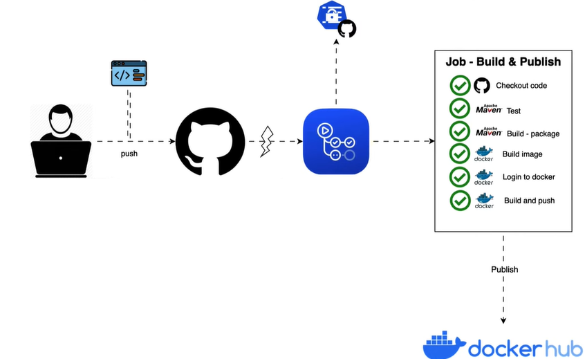

when a dev will push some code to github, the Github action will be activated. Going to read also all the secrets and the build anything with the steps defined in the jobs.

The job:
- checkout the code
- run the unit tests
- build the application
- build the docker image
- login to docker
- publish to docker

then, available in all the infrastructures.


<div style="max-width: 600px; margin: 20px auto; padding: 20px; border-radius: 12px; box-shadow: 0 4px 12px rgba(0,0,0,0.1); background-color: #f9f9f9; font-family: Arial, sans-serif;">
  <h2 style="color: #2c3e50; margin-bottom: 10px;">üìå Motivo principal para construir un pipeline de CI/CD</h2>
  <p style="font-size: 16px; color: #333;">
    <em>"La razón principal para construir un pipeline de integración y entrega continua (CI/CD) es minimizar al máximo la posibilidad de errores humanos durante la integración del código."</em>
  </p>
</div>

## Folder and file Creation

Para comenzar a usar **GitHub Actions** en tu proyecto y automatizar tareas como integración continua (CI) o entrega continua (CD), sigue estos pasos para estructurar correctamente los archivos necesarios:

1. **Ubicación en la raíz del proyecto**  
   En la raíz del repositorio, crea una carpeta llamada **`.github`**. Esta carpeta es especial y GitHub la reconoce automáticamente para configuraciones relacionadas con acciones y plantillas.

2. **Subcarpeta para flujos de trabajo**  
   Dentro de `.github`, crea otra carpeta llamada **`workflows`**. Aquí es donde se almacenarán los archivos YAML que definen los distintos flujos de trabajo que deseas ejecutar automáticamente.

3. **Archivo de definición del workflow**  
   Dentro de la carpeta `workflows`, crea un archivo llamado **`main.yml`** (puede tener cualquier nombre, pero `main.yml` es una convención común). Este archivo contendrá la configuración del pipeline, como los eventos que lo activan (por ejemplo, un `push` o `pull_request`), los *jobs* que deben ejecutarse, y los pasos dentro de cada *job*.

### 📄 Estructura esperada del proyecto

```bash
/tu-proyecto
│
├── .github/
│   └── workflows/
│       └── main.yml
│
├── src/
├── package.json
└── ...
```

Con esta estructura, GitHub detectará automáticamente el archivo `main.yml` y ejecutará el flujo de trabajo definido allí cuando se produzcan los eventos configurados.

## Building the file

### Initial Section

#### name
as first, need a name for the workflow: ```name:```

#### on
then, need to specify when to trigger this action:

```yml
on: # Define when to trigger the pipeline
  push: # Specify the event trigger (pushing code)
    branches: # Specify the branches to monitor
      - main # Trigger only when changes are pushed to the main branch
```

### Jobs (PT1)

---

#### Theory
**Los pipelines se organizan en trabajos (jobs), y cada trabajo puede entenderse como un proceso independiente que se ejecuta en una m√°quina separada.**
Cada uno de estos trabajos puede definirse para ejecutar tareas específicas, como la prueba de la aplicación, la construcción del proyecto y la publicación de la webapp. Además, los trabajos pueden ejecutarse en paralelo o de forma secuencial, dependiendo de las dependencias entre ellos, lo que permite una gran flexibilidad en la automatización de procesos dentro del pipeline.

En el contexto de **GitHub Actions** y los pipelines de CI/CD, los trabajos (jobs) se dividen principalmente en dos categorías según su propósito y ejecución. Cada trabajo puede ser utilizado para automatizar diferentes tareas dentro de un pipeline de integración continua o entrega continua.

##### 1. Jobs de Ejecución Independiente
- **Descripción**: Son trabajos que se ejecutan de manera autónoma, sin depender de otros trabajos en el pipeline. Cada trabajo puede ejecutar una serie de pasos (steps) de forma aislada, y generalmente se utilizan para tareas como pruebas, construcción o despliegue.
- **Ejemplos**:
  - Pruebas unitarias
  - Compilación del código
  - Despliegue a un entorno de producción

##### 2. Jobs de Ejecución Dependiente
- **Descripción**: Son trabajos que dependen de la finalización exitosa de otros trabajos. Este tipo de trabajo se utiliza cuando ciertas tareas deben ejecutarse en secuencia. Los trabajos dependientes se definen con la clave `needs`, que especifica los trabajos que deben completarse antes de que se ejecute el trabajo dependiente.
- **Ejemplos**:
  - Desplegar solo si las pruebas fueron exitosas.
  - Construir una aplicación solo después de que el código ha pasado las pruebas unitarias.

##### Tipos de Jobs Comunes

1. **Test Job**: Trabajo destinado a ejecutar pruebas unitarias o de integración.
2. **Build Job**: Trabajo que compila el código o construye el artefacto final (por ejemplo, la imagen Docker).
3. **Deploy Job**: Trabajo que despliega la aplicación a un entorno (producción, staging, etc.).
4. **Linting Job**: Trabajo que verifica la calidad del código (por ejemplo, usando herramientas como ESLint, Prettier).
5. **Notification Job**: Trabajo que envía notificaciones (por ejemplo, por Slack o correo electrónico) sobre el estado del pipeline.

---

#### Hands on - back on the masterclass

Define the job: ```jobs:``` will be followed by the name you want to give to your job, ```build-deploy``` will be the name of your job. Assign it a name using ```name```, then define a _runner, which refers to the machine where you want to execute the action_. Use ```runs-on``` as the key, and provide the value, which is a list of machines available for execution. In this example, we will use Ubuntu, so you would write: ```runs-on: ubuntu-latest```. Following that, we need to define all the steps that the job needs to go through.


<div style="max-width: 600px; margin: 20px auto; padding: 20px; border-radius: 12px; box-shadow: 0 4px 12px rgba(0,0,0,0.1); background-color: #f9f9f9; font-family: Arial, sans-serif; line-height: 1.4;">
  <h2 style="color: #2c3e50; margin-bottom: 10px;">🏃‍♂️ GitHub Actions Runners</h2>
  <p style="font-size: 16px; color: #333;">
    Un runner en GitHub Actions es una m√°quina que ejecuta los trabajos definidos en los flujos de trabajo (pipelines). Existen dos tipos:
  </p>
  <ul style="font-size: 16px; color: #333;">
    <li>Runners de GitHub: Proporcionados y gestionados por GitHub. Vienen con im√°genes preconfiguradas de sistemas como Ubuntu, Windows o macOS. <em>Ventaja: F√°cil de usar, sin necesidad de configurarlos. Desventaja: Limitado a las configuraciones ofrecidas por GitHub.</em></li>
    <li>Runners auto-hospedados: Configurados y gestionados por el usuario en sus propios servidores o máquinas. <em>Ventaja: Mayor control y personalización. Desventaja: Requiere mantenimiento y configuración adicional.</em></li>
  </ul>
  <h3 style="color: #2c3e50;">¿Cómo funciona un runner?</h3>
  <p style="font-size: 16px; color: #333;">
    Cuando defines un runner en un archivo de flujo de trabajo (como un archivo YAML), GitHub asigna el trabajo a la m√°quina correspondiente seg√∫n el tipo de runner que hayas especificado. Si usas un runner de GitHub, este se asignar√° autom√°ticamente a una de las m√°quinas disponibles de la lista de GitHub-hosted runners. Si usas un runner auto-hospedado, GitHub buscar√° la m√°quina adecuada entre los runners que hayas configurado.
  </p>
  <h3 style="color: #2c3e50;">¿Por qué es importante el runner?</h3>
  <p style="font-size: 16px; color: #333;">
    El runner es esencial porque ejecuta los pasos de tu trabajo. Dependiendo de si es un runner de GitHub o uno auto-hospedado, la máquina puede tener diferentes capacidades, configuraciones y software preinstalado, lo que puede afectar cómo se ejecutan los pasos en tu flujo de trabajo.
  </p>
</div>


vaya a definir, associando un nombre al primero: ```steps:``` , ```-name: checking out the code``` aqui github Actions toma el codigo desde github, ne hace una copia desde el repository y hace una copia en el runner. aqui esta definido a la riga de abaho (runs-on). lluego, nos necesita algo que nos permite de checkout the code. vaya utilizar la propriedad **uses**. Esta propriedad significa que quieremos de usar una **Action**, y la action es **Checkout** the code. Entonces, la Action va a ser: ```uses: actions/checkout@v2```

```yml
    steps:
      - name: checkout code
        uses: actions/checkout@v3
```

> la lista de todas la _Actions_ disponible estan en el market place de github.

#### Setting JDK

Vamos con el **Setup JDK**. Para Spring Boot principiantes, vamos a usar Java 17, lo cual debemos explicarlo en un nuevo step: ```-name: Setup JDK 17``` y ```uses: actions/setup-java@v3```. Aquí, necesitamos especificar las diferentes opciones requeridas por la acción bajo ```with:```, incluyendo ```distribution: 'corretto'``` y ```java-version: 17```.

```yml
      - name: Setup JDK 17 # Paso para configurar Java Development Kit (JDK) versión 17
        uses: actions/setup-java@v3 # Usa la acción para configurar Java
        with: # Especifica las opciones requeridas
            distribution: 'corretto' # Distribución del JDK (Amazon Corretto)
            java-version: 17 # Versión de Java a configurar
```

#### Testing

Ahora comienza la sección de **testing**. En este paso, utilizamos ```- name: Unit test```, donde necesitamos ejecutar nuestro script personalizado para la aplicación. No hay una Action disponible directamente en GitHub para esto. Por lo tanto, utilizamos el siguiente comando: ```run: mvn -B test --file pom.xml```

Observa lo siguiente:
- ```test``` es la operación que Maven (mvn) debe ejecutar. Representa el comando para realizar pruebas unitarias en el proyecto.
- ```pom.xml``` es un archivo ubicado en la carpeta del proyecto. Este archivo, conocido como Maven Project Object Model, contiene la configuración necesaria para el proyecto, incluyendo los pasos y dependencias requeridas para ejecutar las pruebas.


```yml
      - name: Unit Test # Paso para ejecutar pruebas unitarias
        run: mvn -B test --file pom.xml # Ejecuta el script Maven para realizar las pruebas
```

Este paso es crucial para garantizar que las pruebas unitarias de la aplicación se ejecuten correctamente y detecten cualquier error en el código antes de pasar a las siguientes etapas, como la construcción o el despliegue.

#### Build

Ahora el pasaje para **build**: ``` - name: Build the application```. Que tal si necesitamos ejecutar mas comandos en uno step? aqui un ejemplo para _build_ con differentes comandos: ``` run : | ``` , ``` mvn clean ``` y ``` mvc -B package --file pom.xml```

- ```mvn clean```: Este comando limpia los archivos generados previamente por el build, asegurando que el proceso comience desde cero.

- ```mvn -B package --file pom.xml```: Este comando genera el paquete utilizando Maven, basado en las instrucciones dentro del archivo pom.xml.

```yml
- name: Build the Application # Paso para construir la aplicación
  run: | # Ejecutar m√∫ltiples comandos
    mvn clean # Limpiar el paquete (eliminar archivos generados previamente)
    mvn -B package --file pom.xml # Construir el paquete siguiendo las etapas descritas en pom.xml
```

---


> seguiran los pasaje para build el contenedor docker, y push en la nube (hub).

antes, build el codigo hasta esto punto y vaya a ver lo que pasa.

### Effect on GitHub Actions
After pushing the code on github. Let s have a look on the repo folder, in Actions tab, we can see the pipe running
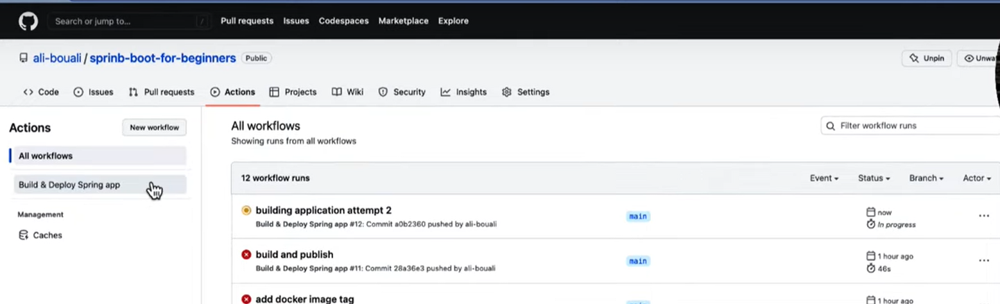
abrela (open it):
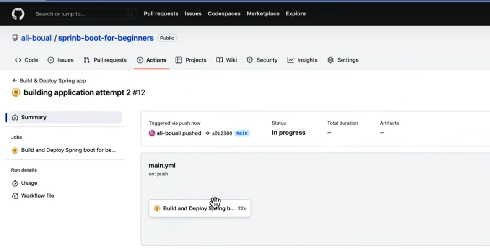
click sobre ``` Build and deploy spring boot ``` que eres el **job name** ya definido en la nuestra configuraccion.
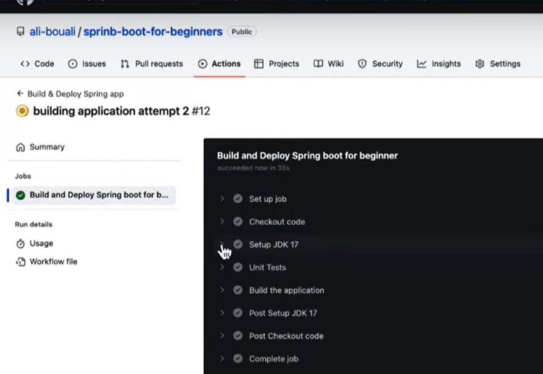
esta es lo que se llama <span style="color: green; font-weight: bold;">_GREEN pipeline_</span>, todos los ```JOBS``` han ejecutato con exito. Vamos a investigar en en JOB de setup JDK 
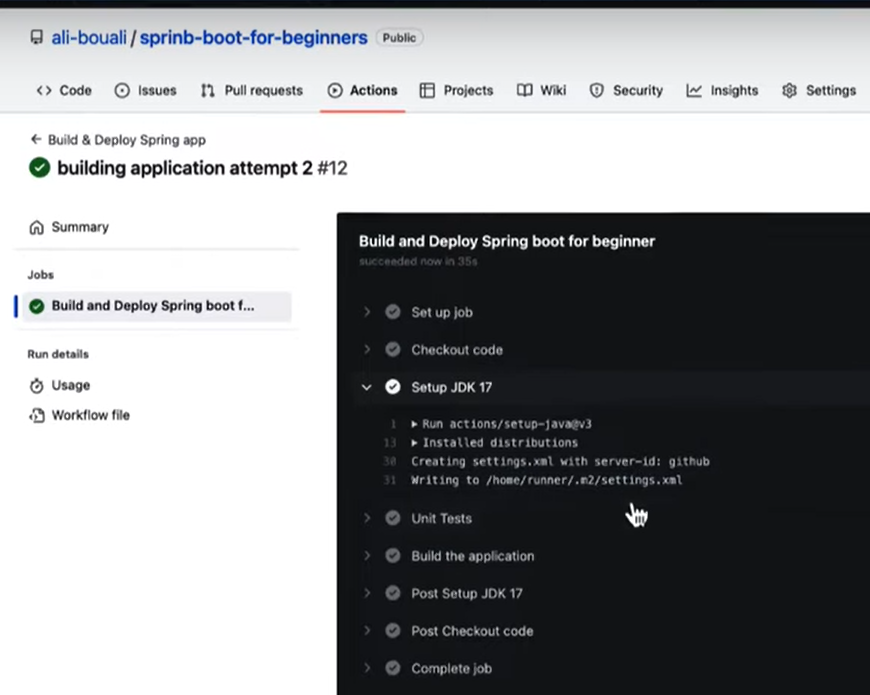
unit test job:
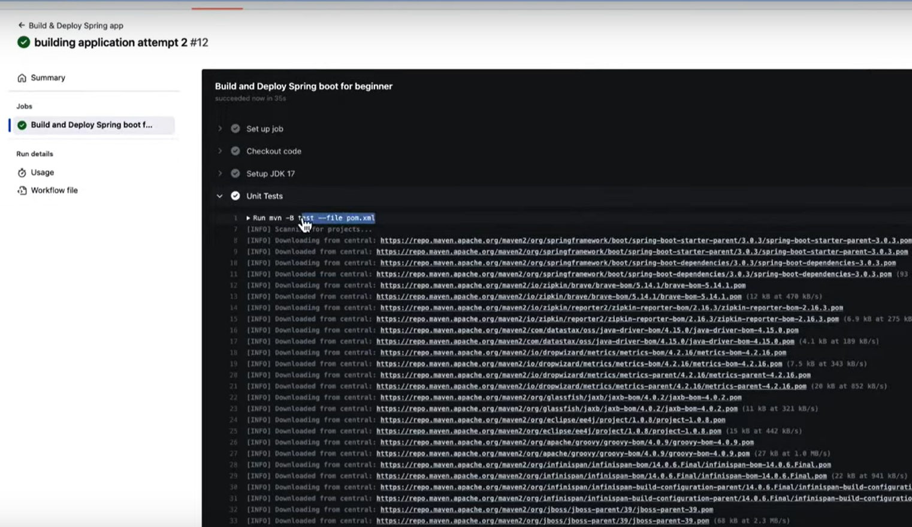
building the application:
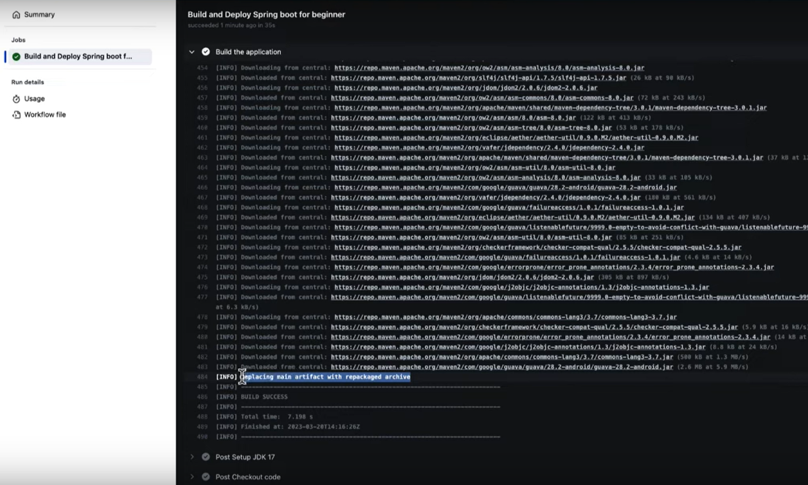

### Docker: image, secrets and token
#### Build the image
Ahora necesitamos de crear el contenedor que vas a contener el nuestro jar file application, lluego costrujamo la imagene y al final publicamos todo en docker hub.
nos falta un nuevo pasaje, esta accion vas a costruir la imagene del contenedor desde el dockerfile que tenemos que specificar y tambien quiere diferentes parametros.

```yml
     - name: Build docker image
       uses: docker/build-push-action@v2 
       with:
         context: . # significa que quieremos de usar el file docker que esta al enlace base de la applicaccion (filepath of app).
         dockerfile: Dockerfile # para speficifar el docker file
         push: false # false for now, at that moment just probando se nos somos capaz de costruir la imagene.
         tags: # for that, we need the dockername / the tags. this is a sensitive information that should be not exposed in public because we will push our code on github. 
```

  so, it requires us to create some **_secrets_** o github Actions.
  here how to do it:

#### Create Secrets for you repo

naviga en el tuyo repo, y clicca sobra de **SETTINGS**
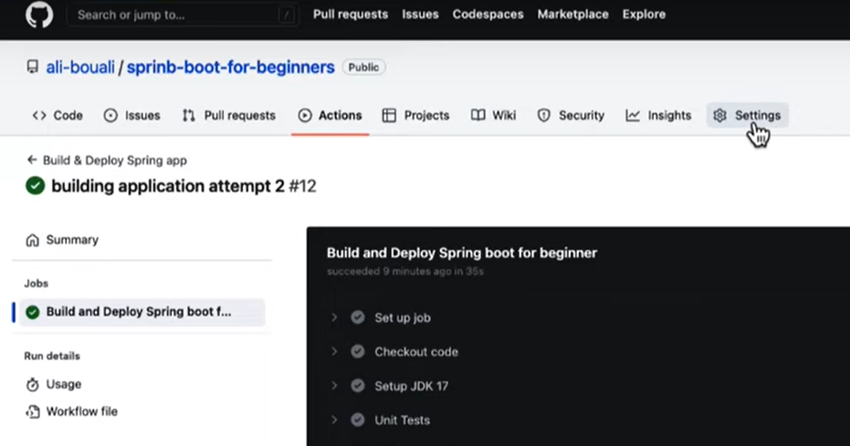
click on **SECRETS AND VARIABLES**
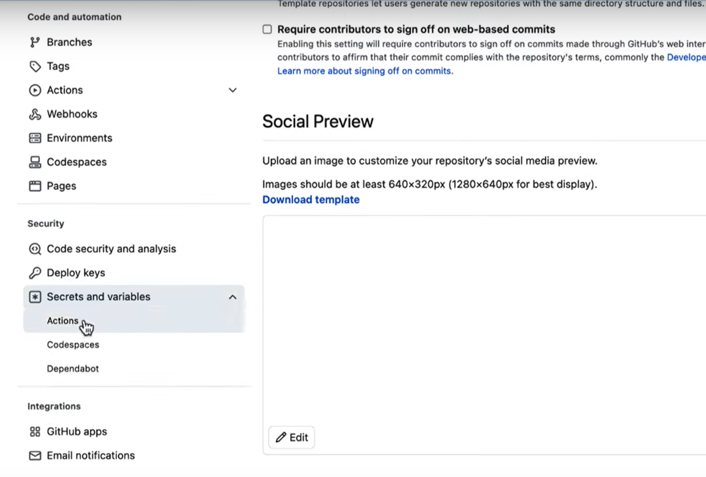
you can create secrets and variables readable from your **GitHub Actions Workflow**, click on **New repository secret**
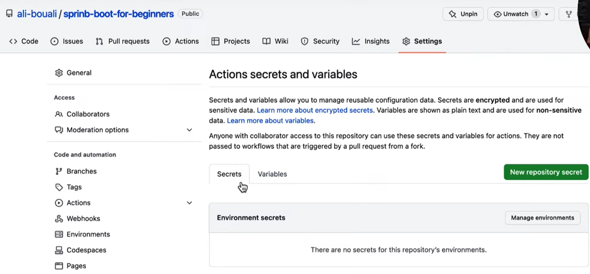
and fill in
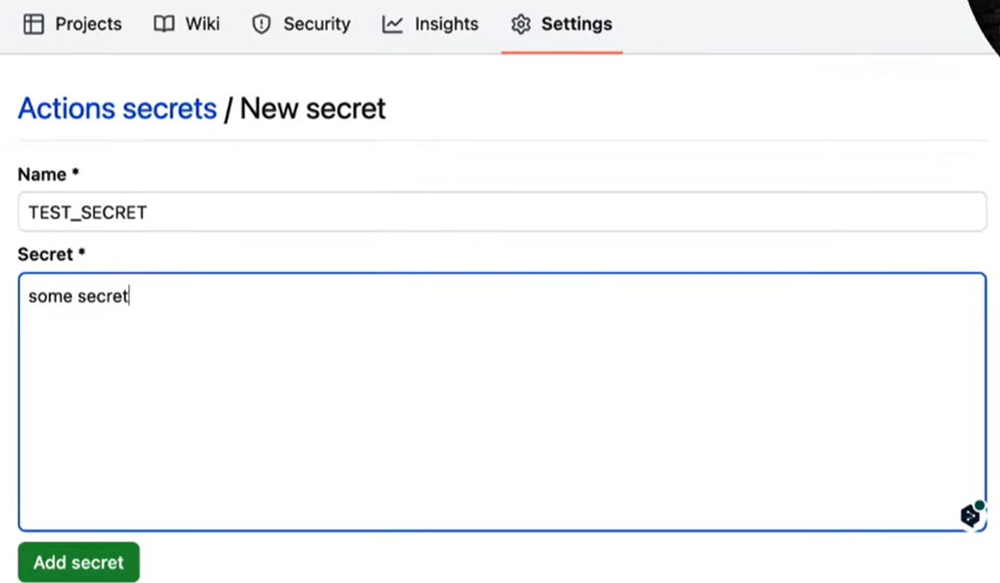
you will see the result in the previous page:
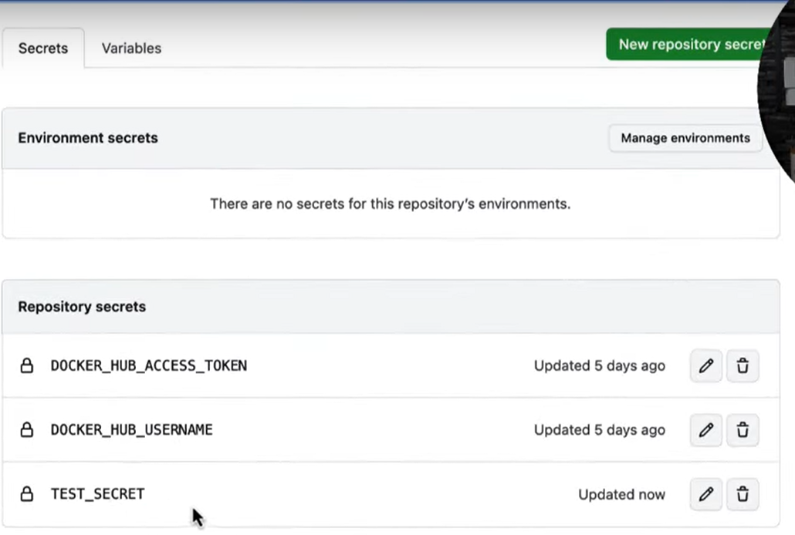

> This secret is only readable by you

#### Create a docker hub access token
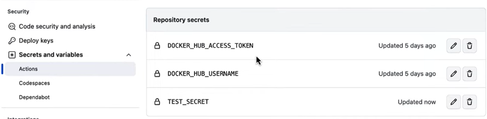
go in docker hub, a click in your profile:
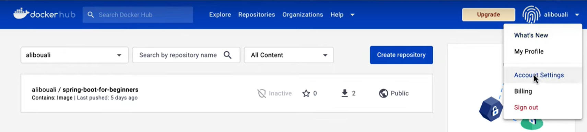
go in **SECURITY** and then click in **NEW ACCESS TOKEN**
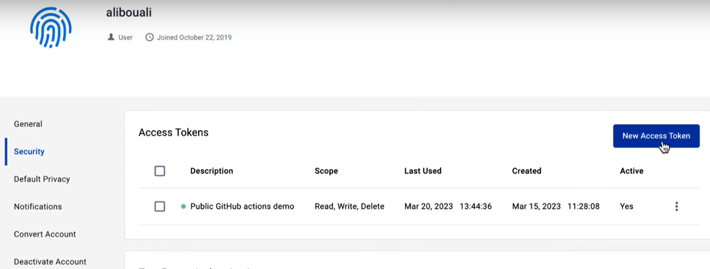
in the new screen, place the **description** and define the **ACCESS PERMISSION**
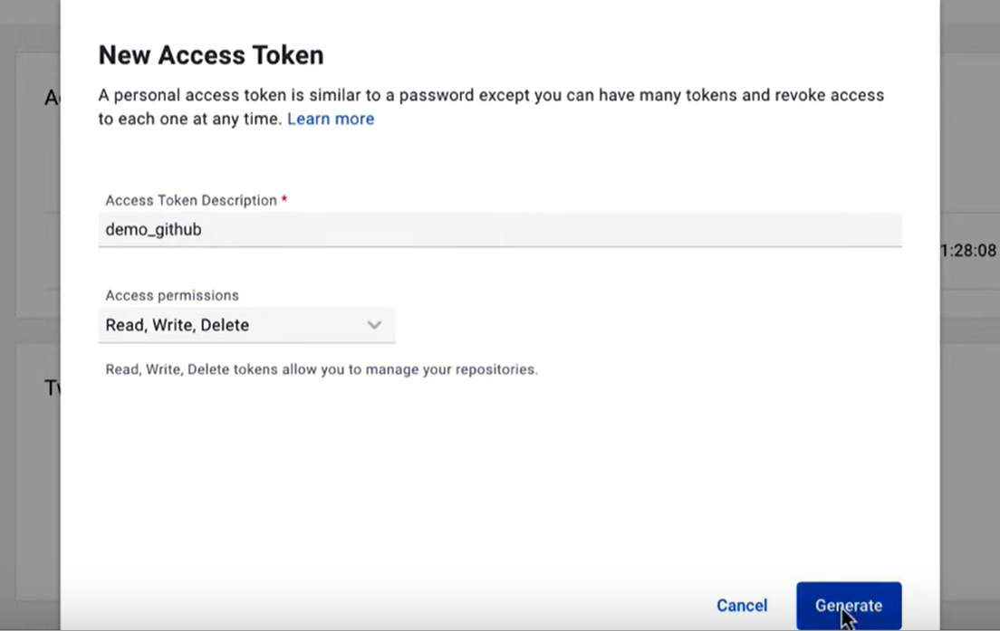
click on **generate**, subrayado esta el token que andras a utilizar:
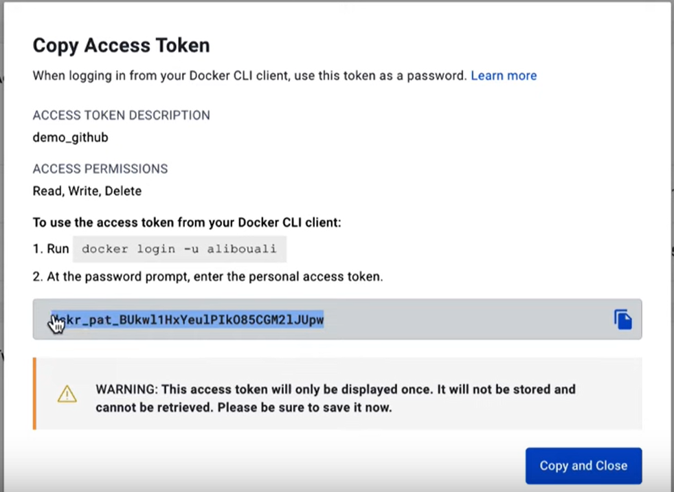
so, copy that one an then go back to the **Actions s Secrets**, create a **NEW REPOSITORY SECRET**, with name: **DOCKER_HUB_ACCESS_TOKEN** and in the **secret** field palce the token just copied from docker hub.

### JOBS (PT2)
#### fill the tag's step with the secret

Back to the yml file for the workflows. now we can fill in the **tags field**

```yml
  - name: Build docker image
    uses: docker/build-push-action@v2
    with: 
      context: .
      dockerfile: Dockerfile
      push: false 
      tags: ${{secrets.DOCKER_HUB_USERNAME}}/spring-boot-for-begineers:latest
```

we need to read the secret:

```yml
tags: ${{secrets.DOCKER_HUB_USERNAME}}/spring-boot-for-begineers:latest
```

or, we can specify a specific image by date

```yml
tags: ${{secrets.DOCKER_HUB_USERNAME}}/spring-boot-for-begineers:$(date-'%Y-%m-%d%H-%M-%S')
```

#### Login to docker hub

para ser capaz de publicar en docker hub, tenemos que connectarnos y hacer el login, tambien ponemos user y pwd

```yml
     - name: Login to docker Hub
       uses: docker/login-action@v1
       with:
        username: ${{secrets.DOCKER_HUB_USERNAME}}
        password: ${{secrets.DOCKER_HUB_ACCESS_TOKEN}}
```

#### push to docker hub

basically same action used to build, but enabling the push.

```yml
- name: Push to Docker Hub # Paso para publicar la imagen en Docker Hub
uses: docker/build-push-action@v2 # Usa la acción Docker build-push - N.B: that Actions is from Docker, not github!
with: # Especifica los par√°metros necesarios
  context: . # El contexto de construcción (directorio actual) - significa que quieremos de usar el file docker que esta al enlace base de la applicaccion (filepath of app).
  dockerfile: Dockerfile # Ruta al archivo Dockerfile
  push: true # Habilita la publicación de la imagen en Docker Hub
  tags: ${{secrets.DOCKER_HUB_USERNAME}}/spring-boot-for-begineers:latest # Etiqueta para la imagen de Docker
```

### Check the results

Lets's push the code and check on github. Back to **Actions** to see the **workflow**:

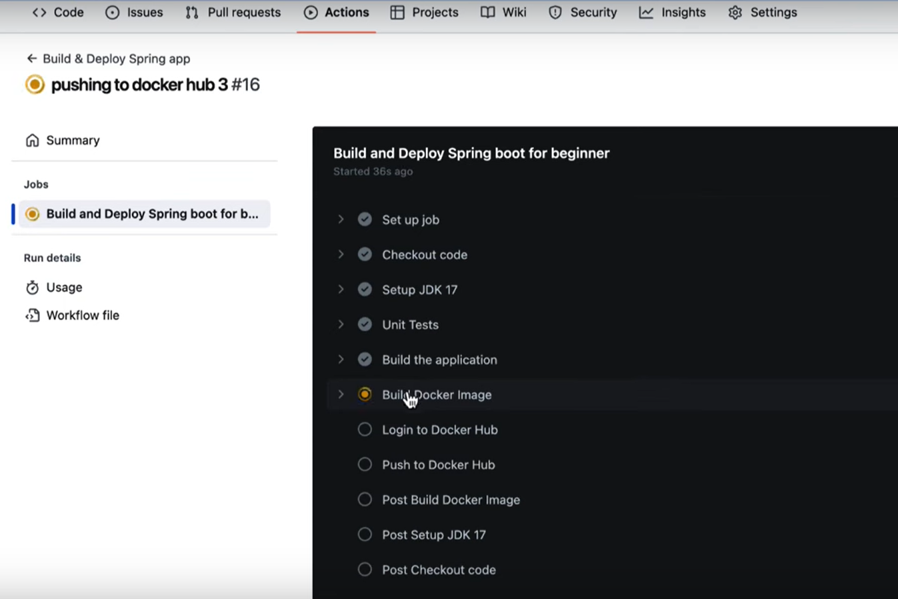

to double check, on docker hub, we can see the image with the tag latest just updated

<div style="text-align: center;">
    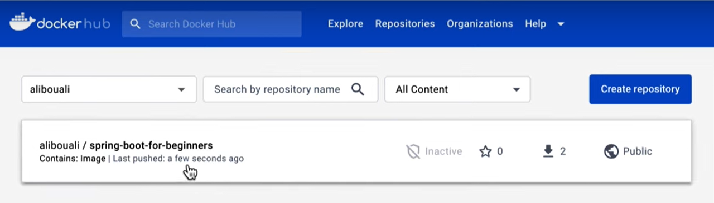
</div>


try with a new tag:

```yml
  tags: ${{secrets.DOCKER_HUB_USERNAME}}/spring-boot-for-begineers:Today # Etiqueta para la imagen de Docker
```

push again on github, and check the Actions.

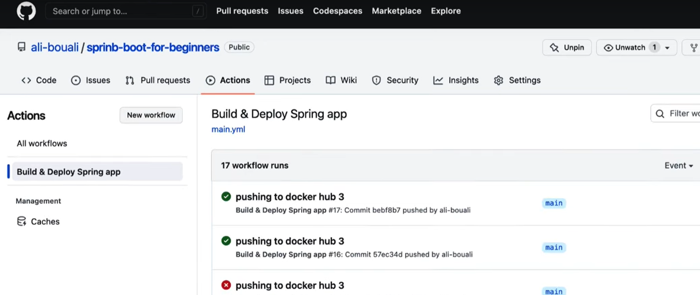

in docker hub, the new image with new tag:

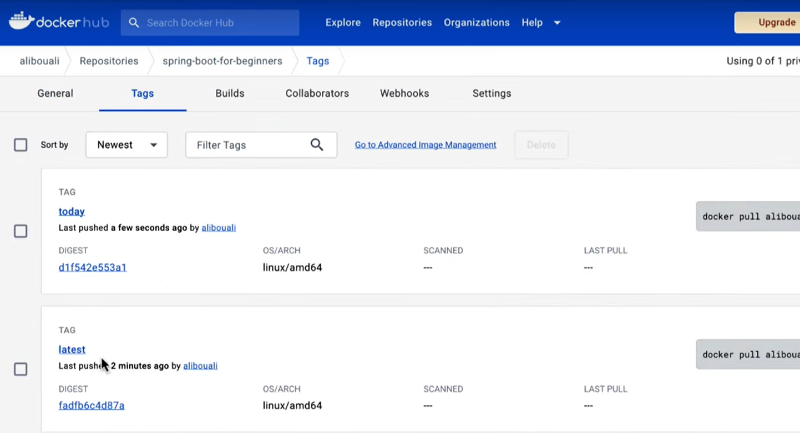


### Full code

File position: .github/workflows/main.yml

```yml
name: Build and deply Spring app
on:
  push:
    branches:
      - main
jobs:
  build-deploy:
    name: build and deploy spring boot for begineer
    runs-on: ubuntu-latest
    steps:
      - name: checkout code
        uses: actions/checkout@v3

      - name: Setip JDK 17
        uses: actions/setup-java@v3
        with: 
          distribution: 'corretto'
          java-version: 17

      - name: Unit Tests
        run: mvn -B test --file pom.xml

      - name: Build the application
        run : | 
        mvn clean 
        mvn -B package --file pom.xml

      - name: Build docker image
        uses: docker/build-push-action@v2
        with: 
          context: .
          dockerfile: Dockerfile
          push: false 
          tags: ${{secrets.DOCKER_HUB_USERNAME}}/spring-boot-for-begineers:latest

      - name: Login to docker Hub
        uses: docker/login-action@v1
        with
          username: ${{secrets.DOCKER_HUB_USERNAME}}
          password: ${{secrets.DOCKER_HUB_ACCESS_TOKEN}}

      - name: Push to docker hub
        uses: docker/build-push-action@v2
        with:
        context: .
        dockerfile: Dockerfile
        push: true
        tags: ${{secrets.DOCKER_HUB_USERNAME}}/spring-boot-for-begineers:latest

```
</div>