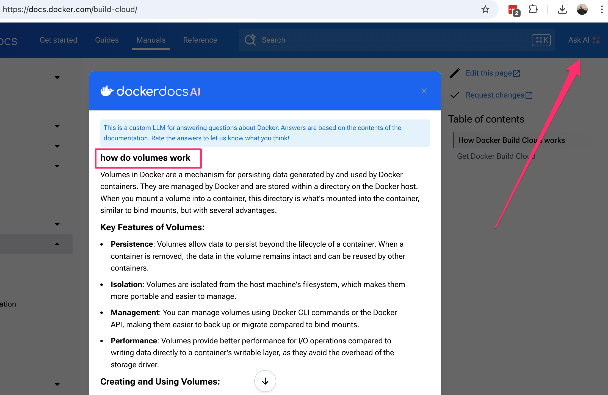
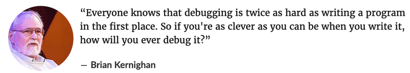

# 1 Getting started

Welcome to the DevOps with Docker course! This course is designed to be completed sequentially, from start to finish. Each part builds on the previous one, so it's important to read the material carefully and complete the exercises to develop the necessary skills.

To pass the course, you will need to complete all of the exercises. However, one exercise can be skipped per part, except for the exercises marked as mandatory. The mandatory exercises cannot be skipped.

The exercises are designed to reinforce the material covered in each part and are placed at strategic points in the course to ensure that you have learned the necessary skills before attempting each exercise. You can complete the exercises at your own pace, and there is no deadline for submission outside of the last date when the entire course ends.

When submitting your exercises, please follow the instructions provided in the course material. Exercises should be submitted in a specific format, which will be outlined in the instructions for each exercise.

We hope that you enjoy the course and find it informative and engaging. Good luck!

## Prerequisites

The course is suitable for anyone interested in Docker or containerization and has at least some experience with the Linux command line. It also helps if you have some experience in web development.

## Enrollment

You do not need to enroll to study in the course. You can enroll only after you have completed the course, see the Getting ECTS credits and the certificate below.

## Learning objectives

The course is divided to three parts or chapters, that are all individually graded.

### Chapter 2: Docker basics (TKT21036 (opens in a new tab)

)

    Understand the fundamental concepts of Docker, including images and containers.
    Learn how to build Docker images for existing projects and run them.
    Understand how Docker can simplify the development process.

### Chapter 3: Docker compose (TKT21037 (opens in a new tab)

)

    Learn how to manage complex multi-container applications with Docker Compose.
    Understand the role of Docker Compose in container orchestration.
    Practice deploying and managing real-world applications using Docker Compose.

### Chapter 4: Security and optimization (TKT21038 (opens in a new tab)

)

    Learn how to optimize Docker images for production, including reducing image size and improving security.
    Understand the limitations of using Docker Compose in production environments and the need for more advanced orchestration tools.
    Explore alternative container orchestration solutions, including Kubernetes.

## Grading

Passing the course parts requires you to do the exercises for each chapter. This means generally every exercise, but you are allowed to skip one non-mandatory exercise in each chapter. So, in order to pass, you must complete

    15/16 exercises in Chapter 2 (TKT21036 DevOps with Docker: Docker basics)
    10/11 exercises in Chapter 3 (TKT21037 DevOps with Docker: Docker compose)
    9/10 exercises in Chapter 4 (TKT21038 DevOps with Docker: Security and optimization)

Some of the exercises are mandatory and can not be skipped.

This course is worth 1-3 ETCS credits depending on the completed chapters. Chapter 1 (the one you are now reading) does not give you any credits. Each of the Chapters 2-4 is worth one ETCS credit.

## Deadline

The sign up for ECTS credits and the course ends 16.6.2025! After that course is locked and submissions can no longer be made or credits earned. As the certificate is received through submissions, you have to submit everything before the course ends.

## Getting ECTS credits and the certificate

After you have completed the exercises and those are graded, you can get the ECTS credits as follows

    Go to the course front page.
    Scroll down until you see an element that says Congratulations!
    Click the REGISTER button.
    Fill in the Open University (University of Helsinki) enrollment form. Be sure to enter the email address that you have used to complete the course in the enrolment form field 'Your email address on the MOOC course'.

You need to repeat the process for each of the course parts you have completed.

Registering the credits takes usually two days.

The course certificates are available also at the course front page.

## General guidance on doing exercises

In most of the exercises, you are asked to submit a set of configurations. Start of each exercise looks like this

Exercises and the course material are using a set of example applications that you can find from [GitHub](https://github.com/docker-hy/material-applications).

When doing exercises you are not supposed to alter the code of the projects!

You do not need to touch Ruby, Java, JavaScript or Python code during this course. You may have to read their error messages.

Visit the Discord channel if you are stuck!

## Where to find information about the course?

All of the details you need to complete the course should be found on this page. If something is missing or unclear after reading this page, please contact matti.luukkainen@helsinki.fi (opens in a new tab) or get in touch through Discord.
Discord​

This course has a Discord group where we discuss everything about the course. Support is available almost 24/7, with the discussion being in both English and Finnish.

Join our discord group [here](https://study.cs.helsinki.fi/discord/join/docker)

All inappropriate, degrading, or discriminating comments on the channel are prohibited and will lead to action taken against the commenter.

## Installing Docker

Containers leverage the power of your own operating system. As such by default any containerized application, or user who has external access to your container, would have super user privileges to your computer.

I will try my best to alert you of potential risks as we encounter them, but due to the structure of the course we will focus on security in Chapter 4.

Please keep this in mind as you move through the installation and exercises. If you ever feel unsure about what you're doing, come to the Discord channel and have a chat with us.

Docker group

To avoid writing sudos you may consider adding yourself to docker group (opens in a new tab)

Keep in mind that if you do so, you can now run containers without sudo and containers give you super user access to the computer.

Use the official documentation to find download instructions for docker-ce for the platform of your choice:

- Ubuntu (opens in a new tab) (opens in a new tab)
- If you have fuksiläppäri, that is, a freshman laptop of the University of Helsinki, do the installation as described here (opens in a new tab) (opens in a new tab)
- MacOS (opens in a new tab) (opens in a new tab)

Windows (opens in a new tab) (opens in a new tab)

Confirm that Docker installed correctly by opening a terminal and running docker -v to see the installed version.

## About different architectures

Please note that while Docker runs on all major operating systems and even on ARM architecture, this course material may not cover platform-specific details for all operating systems. However, we've had students successfully complete the course using a variety of machines and operating systems.

If you encounter any issues while working through the course material on your particular system, we recommend consulting the Docker documentation or seeking help on the course forums. Our community is here to support you and help you succeed in the course!

## Using LLM:s

Large language models such as ChatGPT (opens in a new tab)
, Claude (opens in a new tab) and GitHub Copilot (opens in a new tab)

 have proven to be very useful in software development.

Personally, I mainly use Copilot, which integrates seamlessly with VS Code thanks to the plugin (opens in a new tab)

and has proven out to be quite useful also in the context of Docker.

There are many use cases for LLM usage. For example, you can

    ask LLM for various configurations
    ask LLM to clarify what a given configuration exactly does
    paste error messages and configurations to LLM and ask where the problem might be
    ask clarifications about fundamental concepts

The [Docker documentation](https://docs.docker.com/build-cloud/) currently contains a nice Ask AI feature, where you can "discuss" with the Docker documentation. It gives you both the commands run at the CLI and the high-level descriptions of the underlying concepts:

The degree of usefulness of the hints provided by Copilot and other language models varies. Perhaps the biggest problem with language models is hallucination (opens in a new tab)

, they sometimes generate completely convincing-looking answers, which, however, are completely wrong. When programming, of course, the hallucinated code is often caught quickly if the code does not work. More problematic situations are those where the code or configurations generated by the language model seems to work, but it contains more difficult to detect bugs or e.g. security vulnerabilities.

Another problem in applying language models to software development is that it is difficult for language models to "understand" larger projects, and e.g. to generate functionality that would require changes to several files. Language models are also currently unable to generalize code, i.e. if the code has, for example, existing functions or components that the language model could use with minor changes for the requested functionality, the language model will not bend to this. The result of this can be that the code base deteriorates, as the language models generate a lot of repetition in the code, see more e.g. here (opens in a new tab)

.

When using language models, the responsibility always stays with the programmer.

The rapid development of language models puts the student in a challenging position: is it worth and is it even necessary to learn things at a detailed level, when you can get almost everything ready-made from language models?

At this point, it is worth remembering the old wisdom of Brian Kerningham (opens in a new tab)
, co-author of The C Programming Language:

In other words, since debugging is twice as difficult as programming, it is not worth programming such code that you can only barely understand. How can debugging be even possible in a situation where programming is outsourced to a language model and the software developer does not understand the debugged code at all? The exact same thing applies to configuring Docker and might actually be even more severe, if you do not understand the fundamentals, debugging hard Docker related issues is just impossible.

So far, the development of language models and artificial intelligence is still at the stage where they are not self-sufficient, and the most difficult problems are left for humans to solve. Because of this, even novice developers must learn fundamentals really well just in case. It may be that, despite the development of language models, even more in-depth knowledge is needed. Artificial intelligence does the easy things, but humans need to sort out the most complicated messes caused by AI. GitHub Copilot is a very well-named product, it's Copilot, a second pilot who helps the main pilot in an aircraft. The programmer is still the main pilot, the captain, and bears the ultimate responsibility.

It may be in your own interest that you turn off Copilot by default when you do this course and rely on it only in a real emergency.
Improvements and feedback to the course material

We welcome contributions to the course material from students and other members of the DevOps community! If you notice any mistakes, typos, or errors in the material, please consider submitting a correction or clarification request by pressing the Give feedback button, which gives you two choices 

## About the material

The DevOps with Docker course was created by [Jami Kousa](https://github.com/jakousa) with the help of University of Helsinki's Tietojenkäsittelytieteen osaston sovelluskehitysakatemia ([Toska](https://toska.dev/) ) and [numerous course attendees](https://github.com/docker-hy/docker-hy.github.io/graphs/contributors). This material is based on gist by [Matti Paksula](https://gist.github.com/matti/0b44eb865d70d98ffe0351fd8e6fa35d). You can help develop the course material as well.

As of 2022 the course was handed off to Matti Luukkainen the creator of [Full Stack Open](https://fullstackopen.com/en/part12/basics_of_orchestration#development-in-containers). You can contact him on matti.luukkainen@helsinki.fi (opens in a new tab)

.

This material is following the official Docker guidelines presented on [the official website](https://www.docker.com/legal/trademark-guideline). If you find anything conflicting or otherwise prohibited use, please inform us and we'll make the required changes.

This material is licenced under [Creative Commons BY-NC-SA 3.0 -licence](http://creativecommons.org/licenses/by-nc-sa/3.0/), so you can freely use and distribute the material, as long as original creators are credited. If you make changes to material and you want to distribute altered version it must be licenced under the same licence. Usage of material for commercial use is prohibited without permission.